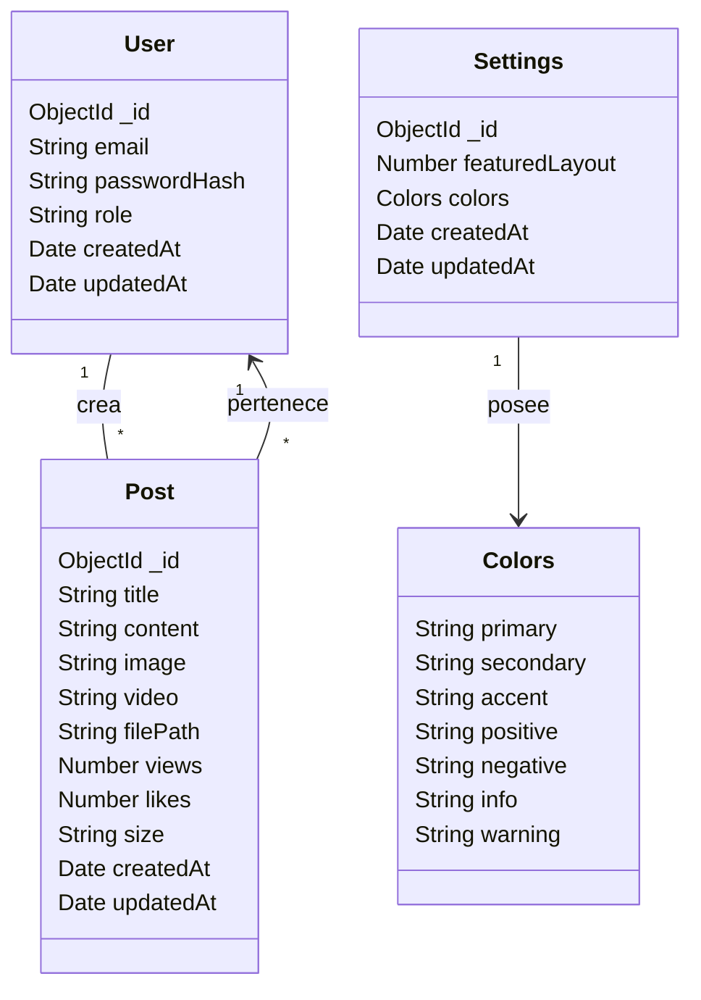
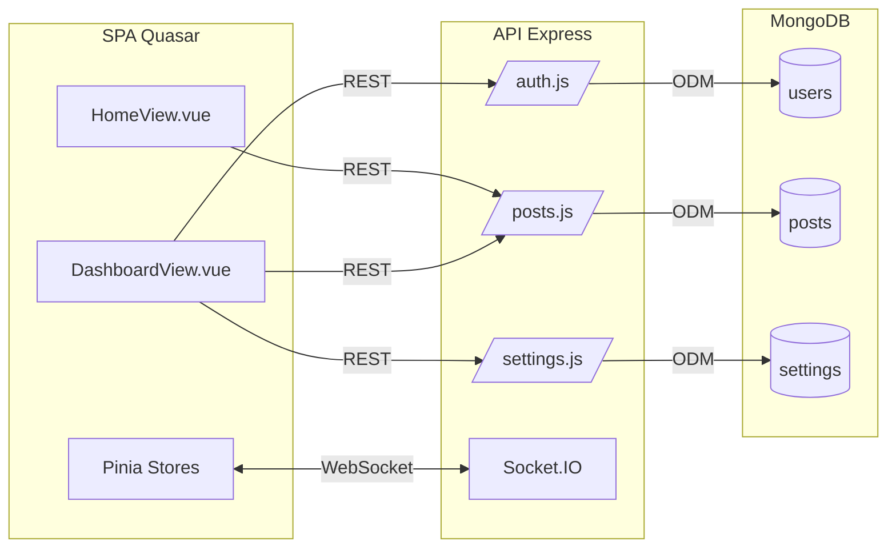

# 05 · Diagramas

## Diagrama de casos de uso (alto nivel)
flowchart TD
  %% Actores
  Admin[Administrador]
  Visitor[Visitante]

  %% Casos de uso
  Autenticar[(Autenticar)]
  Gestionar[(Gestionar publicaciones)]
  Configurar[(Configurar apariencia)]
  Monitorear[(Monitorear métricas)]
  Consultar[(Consultar contenido)]
  Registrar[(Registrar vista)]
  DarLike[(Dar like)]

  %% Relaciones Administrador
  Admin --> Autenticar
  Admin --> Gestionar
  Admin --> Configurar
  Admin --> Monitorear

  %% Relaciones Visitante
  Visitor --> Consultar
  Visitor --> Registrar
  Visitor --> DarLike

  %% Include
  Gestionar -.-> Autenticar
  Configurar -.-> Autenticar

## Diagrama de clases (modelo de dominio simplificado)

## Arquitectura lógica (vista de componentes)

> Los diagramas usan sintaxis Mermaid para permitir su exportación a SVG desde herramientas compatibles (e.g. GitHub, Live Editor).
